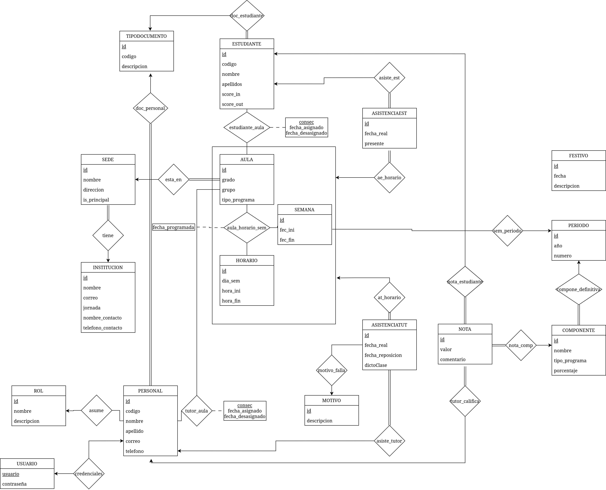

# Global English



Sistema de gestión para institución de idiomas.

## Requisitos

- Docker
- Docker Compose

## Instalación

1. Clonar el repositorio

2. Copiar el archivo de variables de entorno:
```bash
cp .env.example .env
```

3. Ajustar los puertos y configuraciones en `.env` si es necesario

4. Construir las imágenes:
```bash
docker-compose build
```

5. Levantar los servicios:
```bash
docker-compose up
```

## Servicios

- **Backend API**: http://localhost:3000/api
- **Swagger**: http://localhost:3000/api#
- **Frontend**: http://localhost:5173
- **Base de datos**: PostgreSQL en localhost:5432

Los puertos son configurables mediante las variables de entorno.

## Desarrollo

Si modificas el Dockerfile o las dependencias del proyecto, debes reconstruir las imágenes:
```bash
docker-compose build
```

Para cambios en el código fuente no es necesario reconstruir, los cambios se reflejan automáticamente.

## Variables de entorno

Ver `.env.example` para la lista completa de variables configurables.

Principales variables:
- `API_PORT`: Puerto del backend (default: 3000)
- `WEB_PORT`: Puerto del frontend (default: 5173)
- `DB_PORT`: Puerto de PostgreSQL (default: 5432)
- `DB_USER`: Usuario de base de datos
- `DB_PASSWORD`: Contraseña de base de datos
- `DB_NAME`: Nombre de la base de datos